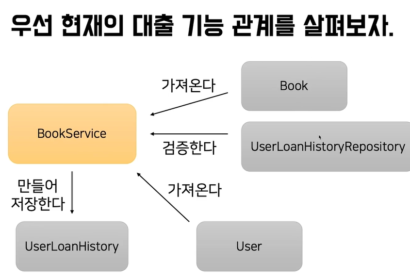
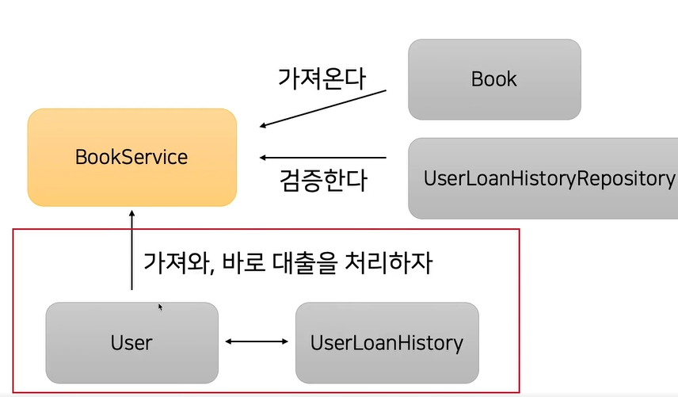

## 객체 지향적으로 개발하는 방법 + JPA 연관관계의 추가적 기능
- SQL 대신 ORM을 사용하게된 이유 중 하나 -> DB 테이블과 객체는 패러다임이 다르기 때문
```
DB 테이블에 데이터를 저장하는 것은 필수임.
JAVA는 객체지향형 언어이고
대규모 웹 앱을 다룰때에도 절차지향적 설계보다 객체지향적인 설계가 좋음.
```
- 연관관계의 기능
```
@OneToOne(mappedBy = "")
1:1 관계 : 테이블별로 하나의 값씩 매칭 (ex: 나와 나의 주소)

@ManyToOne, OneToMany
N:1 관계 : 연관관계의 주인이 반드시 N쪽(ex: 학생1과, 대출 개수N)
단방향으로만 쓸 수 있음. (OneToMany 지워도 상관 없음)
@ManyToMany

N:M 관계 : (학생, 동아리 관계) 하지만 잘 안씀

@JoinColumn : 연관관계의 주인이 활용할 수 있는 어노테이션
필드의 이름이나, null여부, 유일성 여부, 업데이트 여부들을 지정

cascade 옵션 : 연결되어 있는 객체도 함께 저장되거나 삭제되는 기능
@OTM, MTO 안에 cascade = cascadeTYPE.ALL 로 지정가능
ex) A 유저가 1,2책을 빌렸을때, A 유저를 지우면 1,2 같이 사라짐!

orphanRemoval 옵션 : 객체간의 관계가 끊어진 데이터를 자동으로 제거하는 옵션
```
- 처리 전

- 변경전 코드
```
UserLoanHistory
     private long userId; 
     ->
     @ManyToOne
     private User user;
     
     public UserLoanHistory(long userId, String bookName) {
        this.userId = userId;
        this.bookName = bookName;
        this.isReturn = false;
    }
    ->
    public UserLoanHistory(User user, String bookName) {
        this.user = user;
        this.bookName = bookName;
        this.isReturn = false;
    }
     + bookService도 userid 대신 user로 변경
    
     
User
    @OneToMany(mappedBy = "user")
    private List<UserLoanHistory> userLoanHistories = new ArrayList<>();
추가

    public void loanBook(String bookName) {
        this.userLoanHistories.add(new UserLoanHistory(this, bookName));
    }
추가
    public void returnBook(String bookName) {
        UserLoanHistory targetHistory = this.userLoanHistories.stream()
                .filter(history -> history.getBookName().equals(bookName))
                .findFirst()
                .orElseThrow(IllegalArgumentException::new);
        targetHistory.doReturn();
    }
추가


BookService
        // 4. user 정보 가져오기
        User user = userRepository.findByName(request.getUserName())
                .orElseThrow(IllegalArgumentException::new);

        // 5. 유저 정보와 책 정보를 기반으로 userloanHistory를 저장
        userLoanHistoryRepository.save(new UserLoanHistory(user, book.getName()));

    }
    ->
        // 4. user 정보 가져오기
        User user = userRepository.findByName(request.getUserName())
                .orElseThrow(IllegalArgumentException::new);
        user.loanBook(book.getName());
    }
    
        UserLoanHistory history = userLoanHistoryRepository.findByUserIdAndBookName(user.getId(), request.getBookName())
                .orElseThrow(IllegalArgumentException::new);
        history.doReturn();
    ->
    user.returnBook(request.getBookName());
    


이때 연관관계의 주인 (Table을 보았는데 주도권을 가지고 있는 것)
- 테이블을 보고, 누가 상대방을 잡고 잇는가? (user, user_loan_history 중에서는 history쪽이 주인)
- 이쪽에 mappedBy = '연관관계의 주인의 필드이름'을 써야함.
- 이렇게 해야 데이터가 저장됨.

연관관계를 사용하면 좋은점
1. 각자의 역할에 집중하게 됨. (응집성이 좋아짐)
2. 새로운 개발자가 코드를 읽을때 이해하기 쉬워짐.
 그렇다고.. 항상! 쓰지는 마세요!
 
```
- 처리 후


